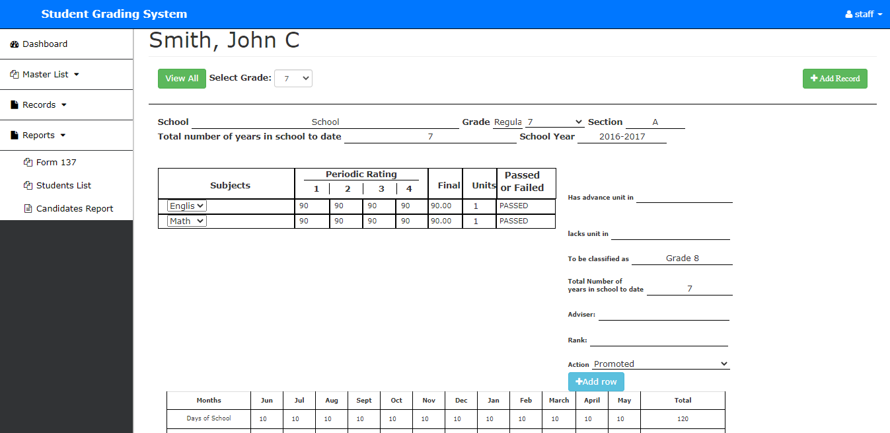

# Student Management System 🎓

A comprehensive web-based system for managing student records, grades, curriculums, and academic workflows. Built with PHP, MySQL, and Bootstrap.

 


## Features ✨
- **Role-Based Access**: Admins, teachers, and students have tailored dashboards.
- **Student Management**: Add, edit, and promote students across school years.
- **Grade Management**: Record grades, generate Form 137 reports, and track academic performance.
- **Curriculum Design**: Create and update subjects, programs, and curriculums.
- **Reporting Tools**: Generate candidate lists, statistical charts, and audit logs.
- **Database Backup**: Built-in tools for database backup and restoration.
- **Responsive UI**: Bootstrap-powered interface with DataTables integration.


## Technologies Used 🛠️
- **Backend**: PHP, MySQL
- **Frontend**: HTML, Bootstrap, JavaScript, jQuery
- **Libraries**: Font Awesome, DataTables, FusionCharts, Morris.js
- **Database Management**: SQL scripts for schema setup.


## Directory Structure Overview 📂

<div>
  <pre>
krdevanshu06-studentmanagementsystem/
├── grading/                 # Core application logic
│   ├── Students.php         # Student CRUD operations
│   ├── auth.php             # Authentication handlers
│   ├── form137.php          # Generate student report cards
│   ├── statistical.php      # Analytics and charts
│   └── SCESGS/              # Sub-module for grading workflows
│       ├── DATABASE/grading_system.sql  # Sample database schema
│       ├── view_records.php # View student records
│       └── ...              # Other utility files
├── assets/                  # Static assets (CSS, JS, fonts)
├── database/grading_db.sql  # Main database schema
└── ...                      # Additional modules and utilities
</pre>
</div>


## Installation 🚀

1. **Clone the repository**:
   ```
   git clone https://github.com/krdevanshu06/studentmanagementsystem.git
   cd studentmanagementsystem
   ```

2. **Import the database**:
   - Use `database/grading_db.sql`.
   - Update database credentials in `grading/connect.php` and `grading/db.php`.

3. **Configure the server**:
   - Point your web server (e.g., Apache) to the `grading/` directory.
   - Ensure PHP extensions (MySQLi) are enabled.

4. **Access the system**:
   - Visit `http://localhost/studentmanagementsystem/grading/` in your browser.
   - Login with default credentials (e.g., admin/admin123 – *change after setup*).


## Usage Guide 📘

- **Admins**:
  - Manage users, school years, and curricula via `users.php`, `school_year.php`, etc.
  - Promote students using `promote.php`.
- **Teachers**:
  - Input grades via `grade.php` or `addrow_grades.php`.
  - Generate reports in `report.php` or `student_report.php`.
- **Students**:
  - View grades and records in `view_students.php`.


## Contributing 🤝

1. Fork the repository.
2. Create a feature branch: `git checkout -b feat-awesome-new-feature`.
3. Commit changes: `git commit -m 'Add awesome feature'`.
4. Push to the branch: `git push origin feat-awesome-new-feature`.
5. Open a **Pull Request** detailing your changes.

#

**Need Help?**  
Open an issue or contact [@krdevanshu06](https://github.com/krdevanshu06).  
*Star this repo if you found it useful! ⭐*
